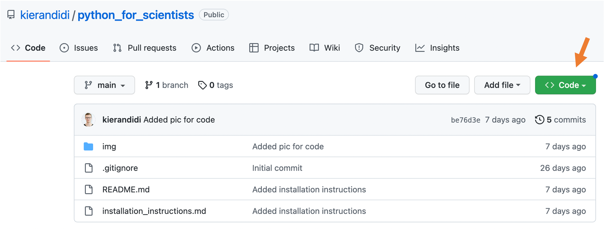

# Advanced Python for Scientists Course

Heidelberg University, summer semester 2023, organised by [Kieran Didi](https://github.com/kierandidi)

Dear all, 

this is the repository that we will use during our course. 

You can download it by clicking on the green "_CODE_" button and choosing "Download ZIP".

Make sure to not change the folder structure of the repository or else some image links might get broken and not work anymore.

For questions write in the course discord or drop me a mail: kieran.didi@stud.uni-heidelberg.de

## Overview of the course

**03.06**|**04.06**|**10.06**|**11.06**
:-----:|:-----:|:-----:|:-----:
*Advanced Constructs*|*Programming Styles*|*Misc*|*Tools*
Iterators/Generators|Functional Programming|Itertools/Functools|Debugger/VSCode
Closures/Decorators|Object-oriented Programming|Context Managers/args and kwargs|CLI
Descriptors/Properties/|OOP Continued, Dunder Methods|Type Hints| Git
